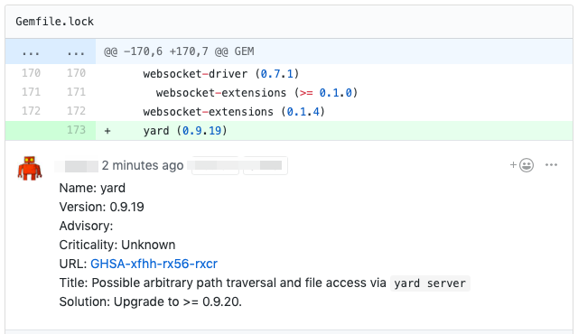

# Maintainer needed

Unfortunately, I (@pdobb) am no longer working on any projects and, therefore, don't have a good way to test fixes. There are probably numerous fixes needed right now as pronto 0.11.0 has been recently released and since there is no proper API for using pronto's internals, each update to pronto will likely mean breaking changes in gems such as this one. But, probably... especially this one. This gem attempts to do something that pronto isn't made for: examine code from a file that isn't necessarily contained within the diff that pronto is analyzing. Most of pronto-bundler_audit is attempting to solve this problem by overriding the pronto API  with custom adapter objects standing in for Pronto-native object.


[](https://badge.fury.io/rb/pronto-bundler_audit)
[](https://travis-ci.org/pdobb/pronto-bundler_audit)
[](https://codeclimate.com/github/pdobb/pronto-bundler_audit/maintainability)
[](https://codeclimate.com/github/pdobb/pronto-bundler_audit/test_coverage)

# Pronto::BundlerAudit

Pronto runner for [bundler-audit](https://github.com/rubysec/bundler-audit), patch-level verification for bundler. [What is Pronto?](https://github.com/prontolabs/pronto)

## Installation

Add this line to the `development` group of your application's Gemfile:

```ruby
gem 'pronto-bundler_audit', require: false
```

And then execute:

    $ bundle

Or install it yourself as:

    $ gem install pronto-bundler_audit

## Compatibility

Tested MRI Ruby Versions:
* 2.4
* 2.5
* 2.6
* edge

NOTE: pronto-bundler_audit v0.7.0 requires pronto v0.11+ and bundler-audit v0.8+. Use pronto-bundler_audit v0.6.0 if you cannot update pronto and bundler-audit at this time.

## Usage

Once installed as a gem, this runner activates automatically when [running Pronto](https://github.com/prontolabs/pronto#usage) -- no configuration is required.

Note: Unlike most Pronto runners, pronto-bundler_audit will always scan Gemfile.lock whenever Pronto is run. That is, this runner does not only run against patches/diffs made on Gemfile.lock. The point is to find issues/advisories on every Pronto run, not just when Gemfile.lock has been updated. Because, otherwise, this gem  wouldn't really help us find vulnerabilities in a project's gems in a timely fashion.

## Configuration

Configuration of the pronto-bundler_audit gem is available by creating a YAML file on the project root, called `.pronto-bundler_audit.yml`.

Available configuration options include:

```yaml
Advisories:
  # Send the following advisory names to bundler_audit's `ignored` option.
  Ignore:
    - CVE-YYYY-####1
    - CVE-YYYY-####2
```

The above acts the same as running `bundle-audit check --ignore CVE-YYYY-####1 CVE-YYYY-####2`.


## Examples

### Local Pronto Run

#### Compact Mode

```bash
$ pronto run -c=master --runner bundler_audit
Running Pronto::BundlerAudit
Gemfile.lock: E: Gem: bootstrap-sass v3.4.0 | Medium Advisory: XSS vulnerability in bootstrap-sass -- CVE-2019-8331 (https://blog.getbootstrap.com/2019/02/13/bootstrap-4-3-1-and-3-4-1/) | Solution: Upgrade to >= 3.4.1.
```

#### Verbose Mode

```bash
$ pronto run -c=master --runner bundler_audit
Running Pronto::BundlerAudit
Gemfile.lock: E: Name: bootstrap-sass
Version: 3.4.0
Advisory: CVE-2019-8331
Criticality: Medium
URL: https://blog.getbootstrap.com/2019/02/13/bootstrap-4-3-1-and-3-4-1/
Title: XSS vulnerability in bootstrap-sass
Solution: Upgrade to >= 3.4.1.
```

#### Continuous Integration Output


#### Github Pull Request - Checks


#### Github Pull Request - Comments

#### Verbose Mode



#### Compact Mode

Note: Not yet available by configuration.


## Development

After checking out the repo, run `bin/setup` to install dependencies. Then, run `rake test` to run the tests. You can also run `bin/console` for an interactive prompt that will allow you to experiment.

To install this gem onto your local machine, run `bundle exec rake install`. To release a new version, update the version number in `version.rb`, and then run `bundle exec rake release`, which will create a git tag for the version, push git commits and tags, and push the `.gem` file to [rubygems.org](https://rubygems.org).

### Testing

GitHub integration testing isn't easy. I have created a test app for myself at: https://github.com/pdobb/pronto-bundler_audit_test_app.


## TODO

* Add configuration for compact vs expanded advisories reporting

## Contributing

Bug reports and pull requests are welcome on GitHub at https://github.com/pdobb/pronto-bundler_audit.

## License

The gem is available as open source under the terms of the [MIT License](https://opensource.org/licenses/MIT).
